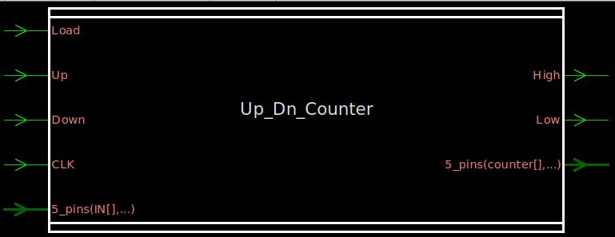
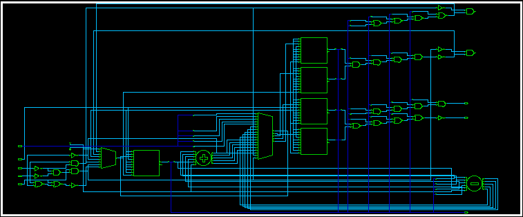
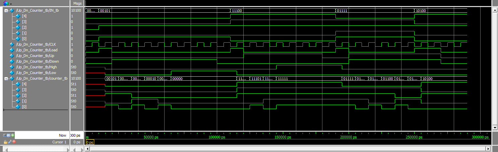

# Up_Dn_Counter — 5-bit Synchronous Up/Down Counter (Verilog)

A parameterizable-style, synchronous 5-bit up/down counter written in Verilog, with a `Load` input for presetting the count, saturating (non-wrapping) behavior at the min/max bounds, and status flags for the high (`11111`) and low (`00000`) limits.

## Features

- **5-bit counter** with synchronous, positive-edge-triggered clocking
- **Load** — synchronously loads an external 5-bit value (`IN`) into the counter, highest priority
- **Up / Down** — increments or decrements the counter by 1 on each clock edge
- **Saturating limits** — the counter holds at `11111` (31) when counting up and at `00000` (0) when counting down; it does **not** wrap around
- **Status flags**:
  - `High` — asserted when `counter == 11111`
  - `Low` — asserted when `counter == 00000`
- **Signal priority**: `Load` > `Down` > `Up` (if more than one control signal is asserted at once, the higher-priority one wins)

## Block Diagram



## Port List

| Signal    | Direction | Width | Description                                  |
|-----------|-----------|-------|-----------------------------------------------|
| `IN`      | Input     | [4:0] | Value loaded into the counter when `Load = 1` |
| `Load`    | Input     | 1     | Synchronously loads `IN` into the counter     |
| `Up`      | Input     | 1     | Increments the counter                        |
| `Down`    | Input     | 1     | Decrements the counter                        |
| `CLK`     | Input     | 1     | Clock (rising-edge triggered)                 |
| `counter` | Output    | [4:0] | Current counter value                         |
| `High`    | Output    | 1     | High when `counter == 5'b11111`               |
| `Low`     | Output    | 1     | High when `counter == 5'b00000`               |

## RTL Schematic



## Design Behavior

On every rising edge of `CLK`:

1. If `Load` is asserted, `counter` is loaded with `IN` (highest priority, regardless of `Up`/`Down`).
2. Else if `Down` is asserted, `counter` decrements by 1 — unless it is already at `00000`, in which case it holds.
3. Else if `Up` is asserted, `counter` increments by 1 — unless it is already at `11111`, in which case it holds.
4. If none of the above are asserted, `counter` holds its value.

`High` and `Low` are combinationally derived from `counter` at all times.

## Testbench

`Up_Dn_Counter_tb.v` instantiates the DUT and drives it through four scenarios that exercise the boundary conditions and signal priority:

| Test Case | Purpose                          | Summary                                                                 |
|-----------|-----------------------------------|--------------------------------------------------------------------------|
| 1         | Floor / `Low` flag                | Load `00101`, count down until the counter saturates at `00000` and `Low` asserts |
| 2         | Ceiling / `High` flag             | Load `11100`, count up until the counter saturates at `11111` and `High` asserts  |
| 3         | Priority: `Down` overrides `Up`   | Load `01111`, assert `Up` and `Down` together — counter counts down     |
| 4         | Priority: `Load` overrides all    | Assert `Load`, `Up`, and `Down` together — counter loads the new value  |

A free-running clock (10 ns period) is generated in the testbench, and a `$monitor` prints every relevant signal transition to the transcript.

### Waveform



### Sample Transcript Output

```
# Time: 65000 | IN: 00101 | Load: 0 | Up: 0 | Down: 1 | Counter: 00000 | High: 0 | Low: 1
# Time: 145000 | IN: 11100 | Load: 0 | Up: 1 | Down: 0 | Counter: 11111 | High: 1 | Low: 0
# Time: 205000 | IN: 01111 | Load: 0 | Up: 1 | Down: 1 | Counter: 01110 | High: 0 | Low: 0
# Time: 255000 | IN: 10100 | Load: 1 | Up: 1 | Down: 1 | Counter: 10100 | High: 0 | Low: 0
```

All four test cases pass, confirming saturation behavior and the `Load > Down > Up` priority order.

## Running the Simulation (ModelSim / QuestaSim)

```tcl
cd RTL
vlib work
vlog Up_Dn_Counter.v Up_Dn_Counter_tb.v
vsim -gui work.Up_Dn_Counter_tb
do wave.do
run -all
```

`wave.do` preloads the waveform view with `IN`, `CLK`, `Load`, `Up`, `Down`, `High`, `Low`, and `counter`.

## Linting

The design was checked with **Synopsys SpyGlass** (`Lint/Lint.prj`, `rtl_handoff` methodology) as part of the RTL sign-off flow.

## Repository Structure

```
.
├── RTL/
│   ├── Up_Dn_Counter.v      # RTL design
│   ├── Up_Dn_Counter_tb.v   # Testbench
│   ├── wave.do              # ModelSim/QuestaSim waveform config
│   └── Transcript           # Simulation log
├── Lint/
│   └── Lint.prj             # SpyGlass lint project file
├── images/
│   ├── CounterBlock.png     # Block symbol
│   ├── RTL_Schematic.png    # Synthesized RTL schematic
│   └── Wave.png             # Simulation waveform
├── LICENSE
└── README.md
```
